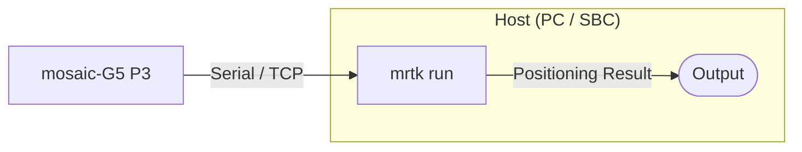
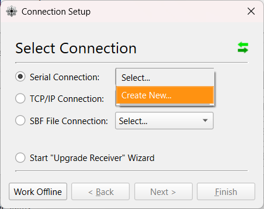
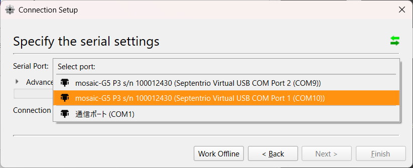
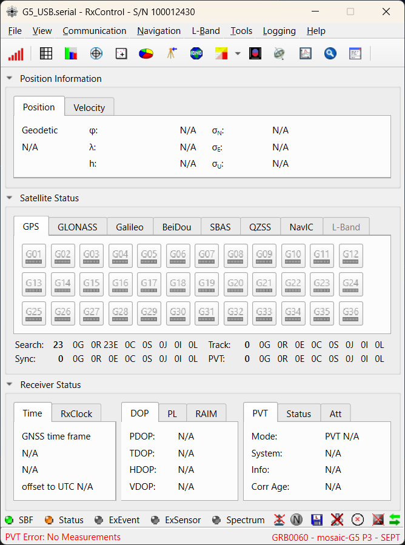
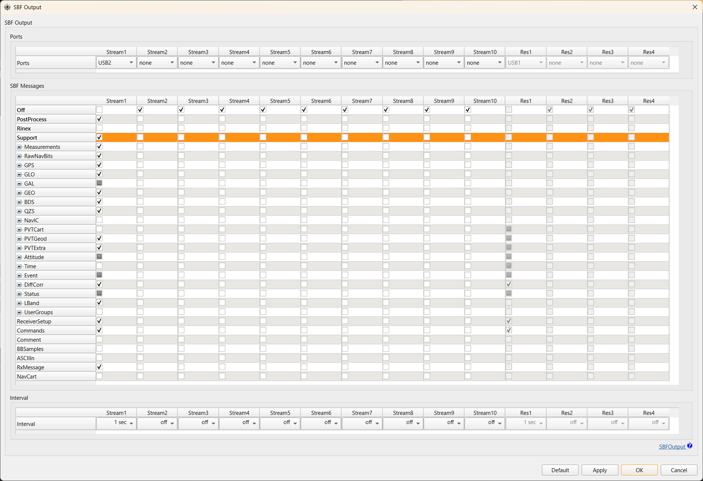
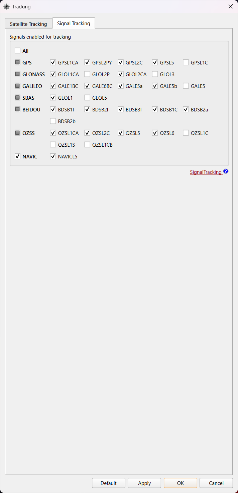
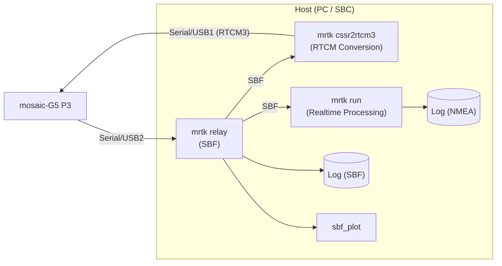
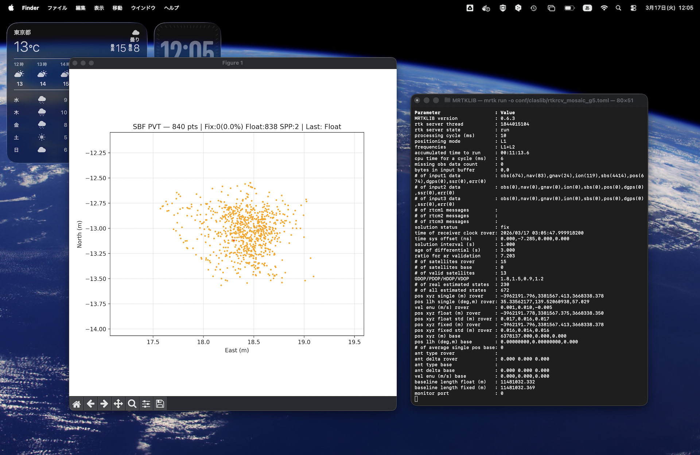
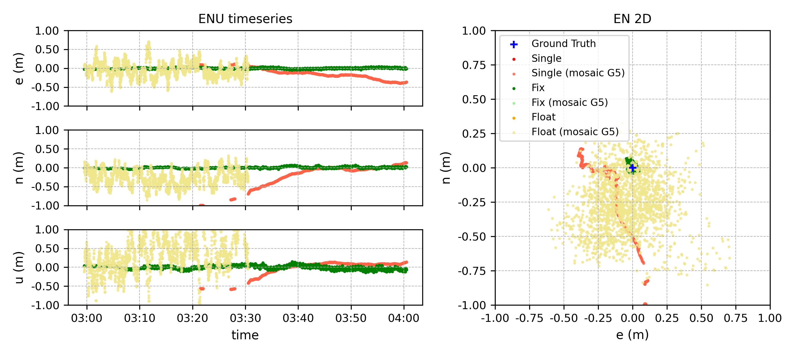

# CLAS Positioning with Septentrio mosaic-G5

This guide describes how to achieve centimetre-level CLAS PPP-RTK positioning
using MRTKLIB with a **Septentrio mosaic-G5 P3** receiver.
We present two approaches: using the receiver's built-in RTK engine with
VRS corrections generated by `mrtk cssr2rtcm3`, and using MRTKLIB's own
PPP-RTK engine via `mrtk run`.

## Overview

### mosaic-G5 P3

The [mosaic-G5 P3](https://www.septentrio.com/en/products/gnss-receivers/gnss-receiver-modules/mosaic-G5-P3)
is one of the few commercially available receivers that can directly track
the QZSS L6 band and output raw L6D data.
In this tutorial we used the
[mosaic-go G5 P3 evaluation kit (mosaic-go G5)](https://www.septentrio.com/en/products/gnss-receivers/gnss-receiver-modules/mosaic-go-g5-p3-evaluation-kit),
which provides a convenient out-of-the-box setup for evaluating the
mosaic-G5 P3 module.

**Supported constellations and bands:**

| Constellation | Bands |
|---------------|-------|
| GPS | L1C/A, L1C, L1PY, L2C, L2P(Y), L5 |
| GLONASS | L1CA, L2CA, L2P, L3 CDMA |
| BeiDou | B1I, B1C, B2a, B2I, B2b, B3I |
| Galileo | E1, E5a, E5b, E6 |
| QZSS | L1C/A, L1C/B, L2C, L5, **L6** |

### Two Approaches: VRS vs. MRTKLIB Engine

|  | VRS (`mrtk cssr2rtcm3`) | MRTKLIB Engine (`mrtk run`) |
|--|------------------------|----------------------------|
| **How it works** | Converts CLAS to RTCM3 and feeds corrections back to the receiver's built-in RTK engine | MRTKLIB's CLAS-dedicated PPP-RTK engine computes the position directly |
| **Advantages** | Lightweight — only format conversion runs on the host, so a minimal SBC (e.g. Raspberry Pi Zero) is sufficient | Purpose-built CLAS engine with optimized correction handling; potentially better accuracy and fix rate |
| **Disadvantages** | Relies on the receiver's generic RTK engine, which is not optimized for CLAS corrections | Requires more compute resources on the host for real-time positioning |

#### Approach 1 — VRS (`mrtk cssr2rtcm3`)

In this approach, MRTKLIB converts CLAS corrections into standard RTCM3 MSM4
messages and feeds them back to the mosaic-G5, which then computes a
VRS-based RTK position using its built-in engine.

1. `mrtk relay` bridges the serial connection to the mosaic-G5, forwarding SBF data to `mrtk cssr2rtcm3` and returning RTCM3 corrections
2. `mrtk cssr2rtcm3` decodes L6D CSSR, computes OSR via `clas_ssr2osr()`, and encodes RTCM3 MSM4
3. The mosaic-G5 receives the RTCM3 corrections and computes a VRS-RTK position
4. `mrtk relay` also outputs the positioning result (SBF/NMEA)


#### Approach 2 — MRTKLIB Engine (`mrtk run`)

In this approach, MRTKLIB performs the PPP-RTK positioning directly.
The mosaic-G5 serves only as an observation and correction source;
all positioning computation happens on the host.

1. `mrtk run` reads the SBF stream from the mosaic-G5 (observations, L6D corrections, and broadcast NAV)
2. MRTKLIB decodes CLAS CSSR and computes the PPP-RTK position internally
3. The positioning result is output directly from `mrtk run`



## Equipment

| Component | Description |
|-----------|-------------|
| **Septentrio mosaic-go G5 P3** | Evaluation kit with mosaic-G5 P3 GNSS module |
| **GNSS antenna** | All-band antenna (L1/L2/L5/L6) |
| **Host PC / SBC** | Linux or macOS machine with MRTKLIB built (PC, laptop, or SBC such as Raspberry Pi) |

## Setting Up the Receiver

[RxTools](https://www.septentrio.com/en/products/gps-gnss-receiver-software/rxtools) is a GNSS receiver control and analysis software suite by Septentrio.
Configure the mosaic-G5 using RxTools (the mosaic-G5 module does not have a Web UI).

1. **Download and install RxTools**: Download the latest version of RxTools from the [Septentrio website](https://www.septentrio.com/en/products/gps-gnss-receiver-software/rxtools) and install it on your computer.

2. **Connect the receiver**: Connect the mosaic-go G5 via USB. The board will be powered over USB and the LED will turn on.

3. **Launch RxControl**: Open RxControl and configure the connection (first time only).

    - Select `Serial Connection` > `Create New...`

    <div style="text-align: center;"></div>

    - Choose the USB COM port, set a `Connection Name`, and click `Finish`.

    <div style="text-align: center;"></div>

    - RxControl will launch after the connection is established.

    <div style="text-align: center;"></div>

4. **Set SBF output**: Go to `Communication` > `Output Settings` > `SBF Output` and configure `Stream 1` as follows:
    - Ports: `USB2`
    - Off: unchecked
    - Support: checked

    Click `Apply`, then `OK` to close.

    <div style="text-align: center;"></div>

    <details>
    <summary>Required SBF blocks (reference)</summary>

    | SBF Block | ID | Purpose |
    |-----------|----|---------|
    | QZSRawL6 | 4066 | QZSS L6 raw data (L6E) |
    | QZSRawL6D | 4270 | QZSS L6D raw data (CLAS CSSR) |
    | GPSNav | 5891 | GPS broadcast ephemeris |
    | GALNav | 4002 | Galileo broadcast ephemeris |
    | QZSNav | 4095 | QZSS broadcast ephemeris |
    | GLONav | 4004 | GLONASS broadcast ephemeris (optional) |
    | BDSNav | 4081 | BDS broadcast ephemeris (optional) |
    | PVTGeodetic | 4007 | Receiver position (used for OSR computation) |

    </details>

5. **Enable L6 tracking**: Go to `Navigation` > `Advanced User Settings` > `Tracking`, select the `Signal Tracking` tab, and enable `QZSSL6`. Click `Apply`, then `OK` to close.

    !!! warning "L6 tracking is disabled by default"
        The mosaic-G5 does not track QZSS L6 signals out of the box.
        Without this step, the SBF stream will contain no `QZSRawL6D` blocks
        and `cssr2rtcm3` will receive no CLAS data.

    <div style="text-align: center;"></div>

6. **Save configuration to the receiver**: Go to `File` > `Copy Configuration` and set:

    | Field  | Value   |
    | ------ | ------- |
    | Source | Current |
    | Target | Boot    |

    Click `Apply`, then `OK` to close.

## Running — Approach 1: VRS

The VRS approach requires two processes running simultaneously: `mrtk relay`
to bridge the serial connection, and `mrtk cssr2rtcm3` to convert CLAS
corrections to RTCM3.

| Port                        | USB  | Usage |
| --------------------------- | ---- | ----- |
| `/dev/*.usbmodem01000124301` | USB1 | RTCM3 input to receiver |
| `/dev/*.usbmodem01000124303` | USB2 | SBF output from receiver |

### Step 1: Start `mrtk relay`

`mrtk relay` connects to the mosaic-G5 serial port, exposes the SBF stream
on a TCP server port, and relays RTCM3 corrections back to the receiver
using the `-b` (relay-back) option.

```bash
# Terminal 1: Bridge serial <-> TCP
mrtk relay \
  -in serial://tty.usbmodem01000124303:115200#sbf \
  -out tcpsvr://:9000#sbf \
  -out file://mosaic-g5.sbf#sbf \
```

- `-in serial://tty.usbmodem01000124303:115200#sbf` — read SBF from the mosaic-G5 `USB2` serial port
- `-out tcpsvr://:9000#sbf` — serve the SBF stream on TCP port 9000 (for `mrtk cssr2rtcm3`)
- `-out file://mosaic-g5.sbf#sbf` — log raw SBF data to file (optional, for post-analysis)

### Step 2: Start `mrtk cssr2rtcm3`

`mrtk cssr2rtcm3` connects to the relay's TCP port, decodes CLAS CSSR from
the SBF stream, and sends RTCM3 MSM4 corrections back through the same
TCP connection.

```bash
# Terminal 2: CSSR -> RTCM3 conversion
mrtk cssr2rtcm3 \
  -k conf/cssr2rtcm3.toml \
  -in sbf://tcpcli://localhost:9000 \
  -out serial://cu.usbmodem01000124301
```

- `-in sbf://tcpcli://localhost:9000` — connect to relay and read SBF (single-stream mode: L6D, NAV, and PVT are all extracted from the same SBF stream)
- `-out serial://cu.usbmodem01000124301` — send RTCM3 MSM4 corrections to the mosaic-G5 via `USB1`

Once CLAS corrections converge (typically 1–2 minutes after startup), the
mosaic-G5 receives the RTCM3 corrections and performs VRS-RTK positioning
internally. The positioning result is available in the SBF output from
the receiver (forwarded by `mrtk relay`).

!!! warning "macOS: use `cu.*` instead of `tty.*` for serial output"
    On macOS, `/dev/tty.*` devices wait for the DCD (Data Carrier Detect) signal
    before completing the open, causing writes to block silently.
    Always use `/dev/cu.*` for serial output to the receiver.
    This does not affect serial input (`mrtk relay -in` reads correctly with either).

### Monitoring with `sbf_plot`

`sbf_plot.py` connects to the relay's TCP port and plots the receiver's
position and fix quality in real time.

```bash
# Terminal 3: Real-time position plot
python3 scripts/plotting/sbf_plot.py --port 9000
```

- Points are colored by fix quality: **green** = RTK Fix, **orange** = RTK Float, **red** = SPP
- The first received position is used as the reference origin (ENU in meters)
- To use an explicit reference: `--ref 35.3231,139.5221`
- Fix rate and satellite count are shown in the title bar

Requires `matplotlib` (`pip install matplotlib`).

### Debug Trace

Add `-d 3` to `mrtk cssr2rtcm3` for detailed processing logs:

```bash
mrtk cssr2rtcm3 \
  -k conf/cssr2rtcm3.toml \
  -in sbf://tcpcli://localhost:9000 \
  -out serial://cu.usbmodem01000124301 \
  -d 3
```

## Running — Approach 2: MRTKLIB Engine

Instead of converting CLAS to RTCM3 and relying on the receiver's RTK engine,
you can run MRTKLIB's own CLAS PPP-RTK engine directly.

### Step 1: Start `mrtk relay`

Same as Approach 1:

```bash
mrtk relay \
  -in serial://tty.usbmodem01000124303:115200#sbf \
  -out tcpsvr://:9000#sbf
```

### Step 2: Start `mrtk run`

```bash
mrtk run -k conf/claslib/rtkrcv_mosaic_g5.toml
```

The MRTKLIB engine reads the SBF stream from the relay, automatically
extracts L6D (CLAS) data from `QZSRawL6D` blocks, and performs PPP-RTK
positioning. The NMEA solution is written to `./clas_rt.nmea` by default.

To output the solution to a TCP server (e.g., for downstream applications):

```bash
mrtk run -k conf/claslib/rtkrcv_mosaic_g5.toml -out tcpsvr://:9002
```

## Configuration

The default configuration `conf/cssr2rtcm3.toml` is suitable for most use cases:

```toml
--8<-- "conf/cssr2rtcm3.toml"
```

Key parameters:

| Parameter | Default | Description |
|-----------|---------|-------------|
| `mode` | `ssr2osr` | SSR-to-OSR conversion mode (required) |
| `systems` | `["GPS", "Galileo", "QZSS"]` | Constellations to include in RTCM3 output |
| `elevation_mask` | `0.0` | Include all visible satellites |
| `ionosphere` | `est-adaptive` | Adaptive ionospheric estimation |
| `cssr_grid` | `clas_grid.def` | CLAS grid definition file |

## Test Results

### Test Configuration

To compare the two approaches, we conducted a static test with the following setup.

**Test Site**

<div style="text-align: center;"></div>

**Block Diagram**



| Process           | Role                                                                     |
| ----------------- | ------------------------------------------------------------------------ |
| `mrtk relay`      | Relay SBF stream to `mrtk cssr2rtcm3` and `mrtk run`                     |
| `mrtk cssr2rtcm3` | Convert CLAS CSSR to RTCM3 MSM4 in real time                             |
| `mrtk run`        | Perform CLAS PPP-RTK positioning in real time                            |
| `sbf_plot`        | Monitor the mosaic-G5 positioning status (PVT mode and position scatter) |


**Receiver Settings (non-default)**

The following mosaic-G5 settings were changed from their defaults for this test:

| Setting (command)                                | Default | Test Value | Reason                                          |
| ------------------------------------------------ | ------- | ---------- | ----------------------------------------------- |
| Maximum RTK Correction Age (`setDiffCorrMaxAge`) | 20.0 s  | 60.0 s     | Accommodate the CLAS-to-RTCM3 pipeline latency  |
| Solution Selectivity (`setSolutionSelectivity`)  | Medium  | Medium     | Default kept; `Loose` may improve Float retention |

**Runtime Screenshot**

The screenshot below shows the test in progress.  Left: `sbf_plot` displaying
the mosaic-G5 position scatter in real time (orange = RTK Float).  Right:
`mrtk run` console output showing the MRTKLIB PPP-RTK engine status.

<div style="text-align: center;"></div>

### Accuracy Comparison (VRS vs. MRTKLIB Engine)

The figure below compares the MRTKLIB PPP-RTK engine (`mrtk run`) with the
mosaic-G5's built-in RTK engine fed by `mrtk cssr2rtcm3`.
The left panel shows the East, North, and Up components over time;
the right panel shows the horizontal scatter.

The MRTKLIB engine (green) achieved a **Fix** solution within approximately
30 seconds and maintained centimetre-level accuracy throughout the session.
The mosaic-G5 internal RTK engine (orange/red) entered **Float** within
the first few minutes but reverted to **SPP** after approximately 30 minutes.
This is likely caused by the `Solution Selectivity = Medium` setting, which
applies strict quality checks that the VRS-based corrections may not satisfy
consistently.  Setting `Loose` may help retain the Float solution longer.

MRTKLIB's PPP-RTK engine is purpose-built for CLAS and applies dedicated
correction handling (STEC interpolation, phase bias application, network-aware
grid selection).  The VRS approach, by contrast, relies on the receiver's
generic RTK engine, which treats the RTCM3 corrections as ordinary base
station observations without CLAS-specific optimizations.

<div style="text-align: center;"></div>
