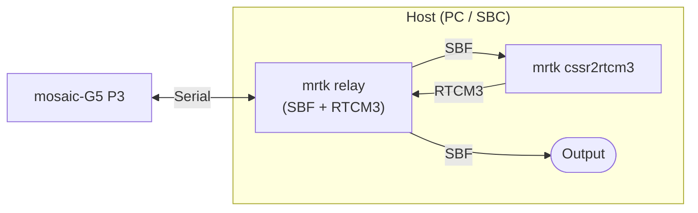

# CLAS Positioning with Septentrio mosaic-G5

This guide describes how to achieve centimetre-level CLAS PPP-RTK positioning
using MRTKLIB with a **Septentrio mosaic-G5 P3** receiver.
We present two approaches: using the receiver's built-in RTK engine with
VRS corrections generated by `mrtk cssr2rtcm3`, and using MRTKLIB's own
PPP-RTK engine via `mrtk run`.

## Overview

### mosaic-G5 P3

The [mosaic-G5 P3](https://www.septentrio.com/en/products/gnss-receivers/gnss-receiver-modules/mosaic-G5-P3)
is one of the few commercially available receivers that can directly track
the QZSS L6 band and output raw L6D data.
In this tutorial we used the
[mosaic-go G5 P3 evaluation kit](https://www.septentrio.com/en/products/gnss-receivers/gnss-receiver-modules/mosaic-go-g5-p3-evaluation-kit),
which provides a convenient out-of-the-box setup for evaluating the
mosaic-G5 P3 module.

**Supported constellations and bands:**

| Constellation | Bands |
|---------------|-------|
| GPS | L1C/A, L1C, L1PY, L2C, L2P(Y), L5 |
| GLONASS | L1CA, L2CA, L2P, L3 CDMA |
| BeiDou | B1I, B1C, B2a, B2I, B2b, B3I |
| Galileo | E1, E5a, E5b, E6 |
| QZSS | L1C/A, L1C/B, L2C, L5, **L6** |

### Two Approaches: VRS vs. MRTKLIB Engine

|  | VRS (`mrtk cssr2rtcm3`) | MRTKLIB Engine (`mrtk run`) |
|--|------------------------|----------------------------|
| **How it works** | Converts CLAS to RTCM3 and feeds corrections back to the receiver's built-in RTK engine | MRTKLIB's CLAS-dedicated PPP-RTK engine computes the position directly |
| **Advantages** | Lightweight — only format conversion runs on the host, so a minimal SBC (e.g. Raspberry Pi Zero) is sufficient | Purpose-built CLAS engine with optimised correction handling; potentially better accuracy and fix rate |
| **Disadvantages** | Relies on the receiver's generic RTK engine, which is not optimised for CLAS corrections | Requires more compute resources on the host for real-time positioning |

!!! note "Performance comparison pending"
    Actual accuracy and fix-rate numbers for both approaches will be added
    after field testing.  The trade-offs listed above are expected
    characteristics based on the architectural differences.

#### Approach 1 — VRS (`mrtk cssr2rtcm3`)

In this approach, MRTKLIB converts CLAS corrections into standard RTCM3 MSM4
messages and feeds them back to the mosaic-G5, which then computes a
VRS-based RTK position using its built-in engine.

1. `mrtk relay` bridges the serial connection to the mosaic-G5, forwarding SBF data to `mrtk cssr2rtcm3` and returning RTCM3 corrections
2. `mrtk cssr2rtcm3` decodes L6D CSSR, computes OSR via `clas_ssr2osr()`, and encodes RTCM3 MSM4
3. The mosaic-G5 receives the RTCM3 corrections and computes a VRS-RTK position
4. `mrtk relay` also outputs the positioning result (SBF/NMEA)



#### Approach 2 — MRTKLIB Engine (`mrtk run`)

In this approach, MRTKLIB performs the PPP-RTK positioning directly.
The mosaic-G5 serves only as an observation and correction source;
all positioning computation happens on the host.

1. `mrtk run` reads the SBF stream from the mosaic-G5 (observations, L6D corrections, and broadcast NAV)
2. MRTKLIB decodes CLAS CSSR and computes the PPP-RTK position internally
3. The positioning result is output directly from `mrtk run`


## Equipment

| Component | Description |
|-----------|-------------|
| **Septentrio mosaic-go G5 P3** | Evaluation kit with mosaic-G5 P3 GNSS module |
| **GNSS antenna** | All-band antenna (L1/L2/L5/L6) |
| **Host PC / SBC** | Linux or macOS machine with MRTKLIB built (PC, laptop, or SBC such as Raspberry Pi) |

## mosaic-G5 SBF Stream Configuration

The mosaic-G5 must be configured to output a **single SBF stream** containing
all required data blocks.  Configure the receiver using RxTools or the
Septentrio command interface (the mosaic-G5 module does not have a Web UI).

### Required SBF Blocks

| SBF Block | ID | Purpose |
|-----------|----|---------|
| QZSRawL6 | 4066 | QZSS L6 raw data (L6E) |
| QZSRawL6D | 4270 | QZSS L6D raw data (CLAS CSSR) |
| GPSNav | 5891 | GPS broadcast ephemeris |
| GALNav | 4002 | Galileo broadcast ephemeris |
| QZSNav | 4095 | QZSS broadcast ephemeris |
| GLONav | 4004 | GLONASS broadcast ephemeris (optional) |
| BDSNav | 4081 | BDS broadcast ephemeris (optional) |
| PVTGeodetic | 4007 | Receiver position (used for OSR computation) |

### RxTools / Command-Line Configuration

Configure the SBF output via the Septentrio command interface (RxTools terminal
or serial connection):

```
# Enable SBF output on the USB serial port (COM1)
setSBFOutput, Stream1, COM1, QZSRawL6+QZSRawL6D+GPSNav+GALNav+QZSNav+PVTGeodetic, sec1
```

!!! tip "GLONav and BDSNav"
    GLONav and BDSNav are optional.  Include them if you want GLONASS or BDS
    satellites in the RTCM3 output.  The default `conf/cssr2rtcm3.toml`
    uses GPS + Galileo + QZSS only.

## Running — Approach 1: VRS

The VRS approach requires two processes running simultaneously: `mrtk relay`
to bridge the serial connection, and `mrtk cssr2rtcm3` to convert CLAS
corrections to RTCM3.

### Step 1: Start `mrtk relay`

`mrtk relay` connects to the mosaic-G5 serial port, exposes the SBF stream
on a TCP server port, and relays RTCM3 corrections back to the receiver
using the `-b` (relay-back) option.

```bash
# Terminal 1: Bridge serial <-> TCP
mrtk relay \
  -in serial://ttyACM0:115200#sbf \
  -out tcpsvr://:9000#sbf \
  -out file://mosaic-g5.sbf#sbf \
  -b 1
```

- `-in serial://ttyACM0:115200#sbf` — read SBF from the mosaic-G5 USB serial port
- `-out tcpsvr://:9000#sbf` — serve the SBF stream on TCP port 9000 (for `mrtk cssr2rtcm3`)
- `-out file://mosaic-g5.sbf#sbf` — log raw SBF data to file (optional, for post-analysis)
- `-b 1` — relay messages from output stream 1 (TCP port 9000) back to the serial input, so RTCM3 corrections from `mrtk cssr2rtcm3` are forwarded to the receiver

### Step 2: Start `mrtk cssr2rtcm3`

`mrtk cssr2rtcm3` connects to the relay's TCP port, decodes CLAS CSSR from
the SBF stream, and sends RTCM3 MSM4 corrections back through the same
TCP connection.

```bash
# Terminal 2: CSSR -> RTCM3 conversion
mrtk cssr2rtcm3 \
  -k conf/cssr2rtcm3.toml \
  -in sbf://tcpcli://localhost:9000 \
  -out tcpcli://localhost:9000
```

- `-in sbf://tcpcli://localhost:9000` — connect to relay and read SBF (single-stream mode extracts L6D, NAV, and PVT)
- `-out tcpcli://localhost:9000` — send RTCM3 MSM4 back to relay, which forwards it to the mosaic-G5 via `-b 1`

The mosaic-G5 receives the RTCM3 corrections and performs VRS-RTK positioning
internally. The positioning result is available in the SBF/NMEA output from
the receiver (forwarded by `mrtk relay`).

### Debug Trace

Add `-d 3` to `mrtk cssr2rtcm3` for detailed processing logs:

```bash
mrtk cssr2rtcm3 \
  -k conf/cssr2rtcm3.toml \
  -in sbf://tcpcli://localhost:9000 \
  -out tcpcli://localhost:9000 \
  -d 3
```

## Running — Approach 2: MRTKLIB Engine

*Section to be completed after field testing.*

## Configuration

The default configuration `conf/cssr2rtcm3.toml` is suitable for most use cases:

```toml
--8<-- "conf/cssr2rtcm3.toml"
```

Key parameters:

| Parameter | Default | Description |
|-----------|---------|-------------|
| `mode` | `ssr2osr` | SSR-to-OSR conversion mode (required) |
| `systems` | `["GPS", "Galileo", "QZSS"]` | Constellations to include in RTCM3 output |
| `elevation_mask` | `0.0` | Include all visible satellites |
| `ionosphere` | `est-adaptive` | Adaptive ionospheric estimation |
| `cssr_grid` | `clas_grid.def` | CLAS grid definition file |

## Test Results

!!! note "Coming Soon"
    Real-world test results with the mosaic-G5 P3 will be added after
    field testing is complete.  Expected metrics include:

    - CSSR decode rate and latency
    - RTCM3 output message rate
    - Downstream receiver fix rate and positioning accuracy
    - Convergence time comparison (VRS vs. MRTKLIB engine)
