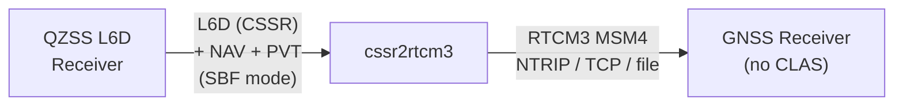

# MRTKLIB v0.4.5 Release Notes

**Release date:** 2026-03-10
**Type:** Feature (cssr2rtcm3 real-time CSSR→RTCM3 converter)
**Branch:** `feat/cssr2rtcm3`

---

## Overview

v0.4.5 adds **`cssr2rtcm3`** — a standalone real-time converter that transforms
QZSS CLAS L6D (CSSR) correction data into RTCM3 MSM4 (OSR) messages.  This
enables CLAS-unsupported GNSS receivers to use QZSS centimetre-level corrections
as a Virtual Reference Station (VRS) via standard NTRIP/TCP protocols.

### Highlights

- **`cssr2rtcm3` application** — Stream-based CSSR→RTCM3 converter with flexible
  I/O (serial, TCP, NTRIP, file).  Outputs RTCM3 1005 (station position) + MSM4
  (1074/1084/1094/1114) per constellation.
- **Septentrio single-stream SBF input** (`-in sbf://...`) — Accepts a
  single SBF stream containing multiplexed L6D, decoded NAV, and PVTGeodetic,
  eliminating the need for separate `-nav` and `-pos`/`-p` arguments.
- **SBF decoder extensions** — 7 new block decoders: QZSRawL6D (4270),
  PVTGeodetic (4007), GPSNav (5891), GLONav (4004), GALNav (4002), BDSNav (4081),
  QZSNav (4095).  Decoded NAV functions ported from demo5.
- **Dual-channel L6** — Optional `-2ch` argument for second L6 correction stream.

> **Note:** Real-device verification with a Septentrio receiver is
> planned but not yet completed.  Only offline file-replay validation has been
> performed so far.

---

## Use Cases



### Typical Configurations

**Legacy mode** (separate L6 + NAV + position):
```sh
cssr2rtcm3 -in serial:///dev/ttyUSB0:115200 \
  -out tcpsvr://:9001 \
  -nav broadcast.nav -p 36.104,140.087,70.0
```

**SBF single-stream mode** (Septentrio receiver):
```sh
cssr2rtcm3 -in sbf://serial:///dev/ttyUSB0:115200 \
  -out tcpsvr://:9001
```

**SBF mode with fixed position override**:
```sh
cssr2rtcm3 -in sbf://tcpcli://192.168.1.100:28785 \
  -out ntripsvr://:pw@caster:2101/VRS \
  -p 35.681,139.767,40.0
```

---

## Architecture

### Data Flow (Legacy Mode)

1. `strread(L6 stream)` → byte-by-byte → `clas_input_cssr()` → CSSR decode
2. `clas_decode_msg() == 10` → epoch boundary → update corrections
3. `actualdist()` → satellite positions → dummy pseudorange observations
4. `clas_ssr2osr()` → OSR (VRS pseudo-observations)
5. `gen_rtcm3(1005 + MSM4)` → RTCM3 binary → `strwrite(output stream)`

### Data Flow (SBF Mode)

1. `strread(SBF stream)` → byte-by-byte → `input_sbf()` → SBF block demux
2. Return code dispatch:
   - `ret==10` (QZSRawL6D) → `clas_input_cssr()` → CSSR pipeline (same as legacy)
   - `ret==2` (decoded NAV) → copy ephemeris to `nav_t`
   - `ret==5` (PVTGeodetic) → update user position (ECEF)
3. Steps 2–5 same as legacy mode

### SBF Block Support

| Block | ID | Description | Return |
|-------|-----|------------|--------|
| QZSRawL6D | 4270 | CLAS L6D message | 10 (L6) |
| PVTGeodetic | 4007 | Receiver SPP position | 5 (position) |
| GPSNav | 5891 | GPS decoded ephemeris | 2 (eph) |
| GLONav | 4004 | GLONASS decoded ephemeris | 2 (eph) |
| GALNav | 4002 | Galileo decoded ephemeris | 2 (eph) |
| BDSNav | 4081 | BDS decoded ephemeris | 2 (eph) |
| QZSNav | 4095 | QZSS decoded ephemeris | 2 (eph) |

---

## Validation

### File Replay (2019/239 Dataset)

| Metric | Value |
|--------|-------|
| Total epochs | 207 |
| Satellite observations | 2,567 |
| RTCM3 messages | 828 |
| Output types | 1005 + MSM4 (1074/1084/1094/1114) |

### Real-Device Verification (Planned)

Real-device verification with a Septentrio receiver is planned:

- [ ] Septentrio SBF serial input → RTCM3 TCP output
- [ ] PVTGeodetic → automatic position update
- [ ] QZSRawL6D → CLAS decode → RTCM3 MSM4 generation
- [ ] Decoded NAV (GPSNav/GALNav etc.) → automatic ephemeris acquisition
- [ ] Long-term stability (24h continuous operation)

### Memory Requirements

- ~112 MB (`rtcm_t` ~103 MB dominant)
- Minimum recommended: Linux SBC with 512 MB+ RAM (e.g. Raspberry Pi Zero 2W)
- Not portable to MCUs (e.g. Seeeduino XIAO) — RAM deficit of 3–4 orders of magnitude

---

## Test Suite (59 tests)

59 tests (unchanged from v0.4.4).  No new CTest entries for `cssr2rtcm3`
(no SBF test data available; manual verification only).

| Test Suite | Tests |
|------------|-------|
| Unit tests | 12 |
| SPP / receiver bias | 4 |
| rtkrcv real-time (MADOCA + CLAS 1ch + CLAS 2ch) | 3 |
| MADOCA PPP / PPP-AR / PPP-AR+iono | 10 |
| CLAS PPP-RTK + VRS-RTK | 19 |
| ssr2obs / ssr2osr / BINEX | 4 |
| Tier 2 absolute accuracy | 2 |
| Tier 3 position scatter | 2 |
| Fixtures | 3 |

---

## Files Changed

| File | Change |
|------|--------|
| `apps/cssr2rtcm3/cssr2rtcm3.c` | New (863→908 lines): real-time CSSR→RTCM3 converter with SBF mode |
| `src/data/rcv/mrtk_rcv_septentrio.c` | +~500 lines: 7 new SBF block decoders (decoded NAV, PVTGeodetic, QZSRawL6D) |
| `CMakeLists.txt` | `cssr2rtcm3` build target |

---

## Scope Exclusions

- **QZSRawL6E (4271)** — For MADOCA; only L6D (CLAS) is supported in this release.
- **MeasEpoch** — Not needed by cssr2rtcm3 (no observation data required).
- **CNAV (GPSCNav, BDSCNav1/2/3)** — LNAV decoded ephemeris is sufficient.
- **CTest integration** — Deferred until SBF test data becomes available.
